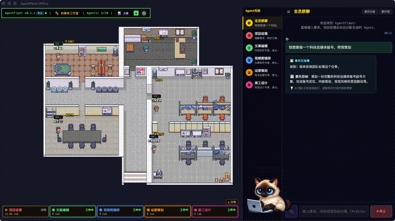
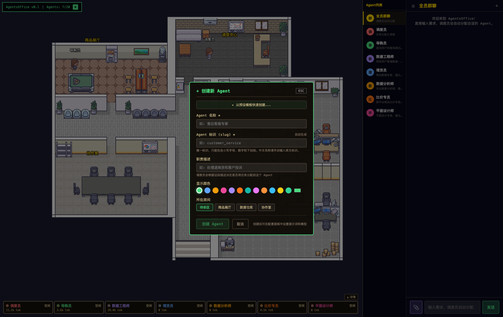

<p align="center">
  
</p>

<h1 align="center">AgentsOffice - AI Digital Workforce Platform</h1>

<p align="center">
  <strong>在像素风 RPG 办公室里，组建你自己的 AI 数字员工团队</strong>
</p>

<p align="center">
  <a href="https://github.com/DBell-workshop/ecommerce-ai-lab/stargazers"></a>
  <a href="https://github.com/DBell-workshop/ecommerce-ai-lab/blob/main/LICENSE"></a>
  <a href="https://github.com/DBell-workshop/ecommerce-ai-lab"></a>
  <a href="https://github.com/DBell-workshop/ecommerce-ai-lab"></a>
</p>

<p align="center">
  <a href="#features">功能</a> ·
  <a href="#quick-start">快速开始</a> ·
  <a href="#scenarios">场景模板</a> ·
  <a href="#architecture">架构</a> ·
  <a href="CONTRIBUTING.md">贡献指南</a> ·
  <a href="LICENSE">许可证</a>
</p>

---

## What is AgentsOffice?

AgentsOffice 是一个 **通用 AI 数字员工平台**。你可以自由定义 Agent 角色、分配职责、设置专业提示词，让它们在像素风 RPG 办公室里协作办公。

> **不绑定任何行业** — 自媒体、客服、开发团队、教育培训……任何需要多角色协作的场景都可以用。

| 传统做法 | AgentsOffice |
|---------|-------------|
| 一个 ChatGPT 窗口干所有事 | **多个专业角色**各司其职 |
| 手动切换不同提示词 | **调度员自动分配**，用户只管提需求 |
| 没有可视化，不知道谁在干啥 | **RPG 办公室**实时可视化 Agent 状态 |

---

<a id="features"></a>
## Features

### 🏢 像素风 RPG 办公室
基于 Phaser 游戏引擎构建的 2D 像素办公室，每个 Agent 有自己的工位、房间和动画。点击 Agent 可以和它对话或配置。

### 🤖 灵活的 Agent 系统（最多 20 个）

- **预设场景模板** — 一键创建自媒体工作室、客服中心、开发团队等角色组合
- **自定义创建** — 通过 ➕ 按钮从零定义角色名称、职责、提示词、模型
- **完整生命周期** — 创建、配置、停用、删除，全部可视化管理
- **AI 优化提示词** — 写下想法，AI 帮你生成专业的 system prompt

<p align="center">
  
  <br/><em>创建自定义 Agent：定义名称、角色、颜色，选择所在房间</em>
</p>

### 💬 智能对话
- **群聊模式** — 调度员自动识别意图，分配给合适的 Agent
- **私聊模式** — 直接和特定 Agent 一对一交流
- **多模型支持** — 每个 Agent 可独立配置不同的 LLM 模型

### 📊 成本透明
- 实时追踪每个 Agent 的 Token 消耗
- 按 Agent / 按模型 / 按时段统计成本
- 底部状态栏一目了然

---

<a id="scenarios"></a>
## 场景模板

开箱即用的团队配置，也可以混搭或从零创建：

| 场景 | 角色 | 适用于 |
|------|------|--------|
| **🎬 自媒体工作室** | 文案编辑、视频剪辑师、运营策划、美工设计 | 短视频/图文创作团队 |
| **📞 客服中心** | 接待客服、投诉专员、回访专员 | 客户服务场景 |
| **💻 开发团队** | 产品经理、开发工程师、测试工程师 | 软件开发流程 |
| **➕ 自定义** | 你来定义 | 任何场景 |

---

<a id="quick-start"></a>
## Quick Start

### 环境要求
- Python 3.11+
- Node.js 18+
- Docker & Docker Compose（用于 PostgreSQL）

### 1. 克隆项目

```bash
git clone https://github.com/DBell-workshop/ecommerce-ai-lab.git
cd ecommerce-ai-lab
```

### 2. 启动数据库

```bash
docker compose up -d
```

### 3. 配置 API Key

```bash
cp .env.example .env
# 编辑 .env，至少填入一个 LLM API Key
```

### 4. 启动后端

```bash
python3 -m venv .venv
source .venv/bin/activate
pip install -r requirements.txt
uvicorn app.main:app --host 0.0.0.0 --port 8001
```

### 5. 打开浏览器

访问 **http://localhost:8001/static/office/**

你会看到像素风办公室和预设的自媒体工作室团队。点击底部 Agent 卡片可以配置，点击右侧聊天框开始对话！

> 💡 **开发模式**（支持热更新）：`cd frontend && npm install && npm run dev`，访问 http://localhost:5173/static/office/

---

<a id="architecture"></a>
## Architecture

```
┌─────────────────────────────────────────────┐
│                  Frontend                    │
│  Phaser RPG Engine + React Overlay + ChatBox │
│  (像素办公室 + Agent面板 + 对话框)             │
└────────────────────┬────────────────────────┘
                     │ REST API
┌────────────────────▼────────────────────────┐
│              FastAPI Backend                  │
│                                              │
│  ┌──────────┐  ┌──────────┐  ┌───────────┐  │
│  │ AgentChat │  │  Agent   │  │  Config   │  │
│  │ (调度/私聊)│  │ Registry │  │   API     │  │
│  └─────┬────┘  └─────┬────┘  └─────┬─────┘  │
│        │             │             │         │
│  ┌─────▼─────────────▼─────────────▼──────┐  │
│  │           Service Layer                 │  │
│  │  LLM Service / Agent Runner             │  │
│  │  Dispatcher / Cost Tracking             │  │
│  └─────────────────┬──────────────────────┘  │
│                    │                         │
│  ┌─────────────────▼──────────────────────┐  │
│  │         PostgreSQL + SQLAlchemy         │  │
│  │      Agents / Config / Cost Records     │  │
│  └────────────────────────────────────────┘  │
└──────────────────────────────────────────────┘
```

**Tech Stack:**
- **Backend**: Python, FastAPI, SQLAlchemy, Pydantic
- **Frontend**: TypeScript, React, Phaser 3 (RPG engine)
- **AI**: LLM via OpenAI-compatible API (Gemini, DashScope/Qwen, OpenAI, DeepSeek, etc.)
- **Database**: PostgreSQL with JSONB
- **Infra**: Docker Compose

---

## Pricing

**AgentsOffice 完全免费。** 所有功能开放，无限制使用。

你只需要自备 LLM API Key（支持阿里云百炼/Google Gemini/OpenAI/DeepSeek 等 OpenAI 兼容接口）。

> 我们相信好的工具应该先让人用起来。

---

## Roadmap

- [x] 像素风 RPG 办公室界面
- [x] 调度员自动路由（LLM Function Calling）
- [x] 群聊 / 私聊对话模式
- [x] Agent 配置面板（身份定义、系统提示词、模型配置）
- [x] AI 优化提示词功能
- [x] 自定义 Agent 角色（创建 / 删除 / 完整生命周期管理）
- [x] 多 LLM 支持（Gemini、OpenAI、DeepSeek、阿里云百炼）
- [x] Token 成本追踪
- [ ] 场景模板一键部署
- [ ] Agent 协作链路（多 Agent 接力完成任务）
- [ ] 移动端适配
- [ ] 插件系统（自定义 Skill / Tool）

---

## Contributing

欢迎贡献！请阅读 [CONTRIBUTING.md](CONTRIBUTING.md) 了解如何参与。

- 提交 Issue 反馈 Bug 或建议功能
- 提交 PR 贡献代码
- 在 [Discussions](https://github.com/DBell-workshop/ecommerce-ai-lab/discussions) 中交流想法

---

## License

本项目采用 [Business Source License 1.1](LICENSE) 许可。

**简单说：**
- ✅ 可以学习、研究、个人使用
- ✅ 可以用于内部评估和测试
- ❌ 未经授权不得商业化使用或提供商业服务
- 📅 4 年后自动转为 Apache 2.0 开源许可

详见 [LICENSE](LICENSE) 文件。

---

<p align="center">
  <sub>Built with ❤️ by the AgentsOffice Team</sub>
</p>
