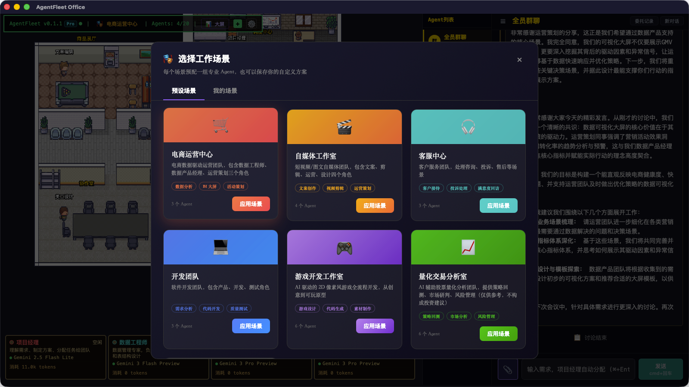
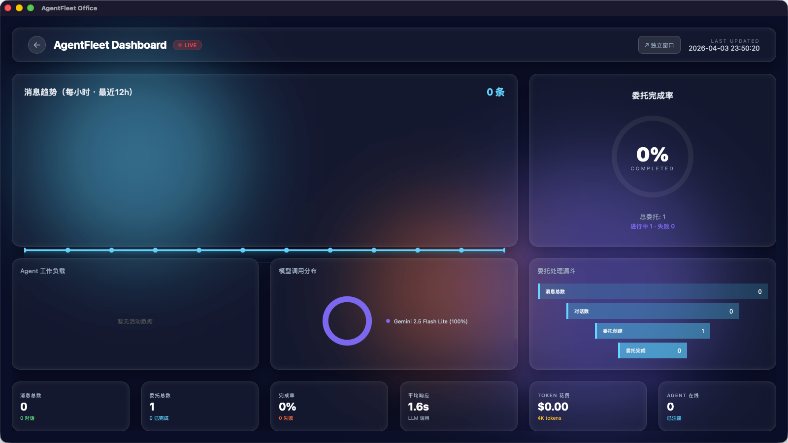
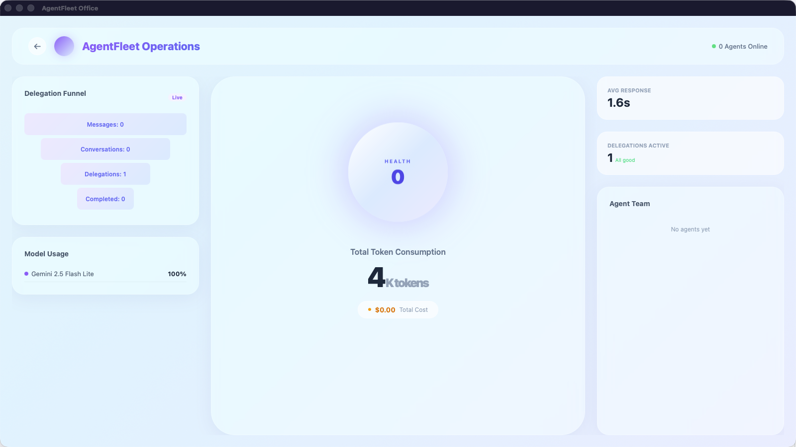
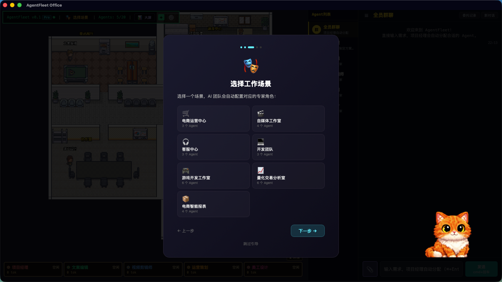

<p align="center">
  <a href="README_zh-CN.md">简体中文</a> ·
  <a href="README_zh-TW.md">繁體中文</a> ·
  <a href="README.md">English</a> ·
  <a href="README_ja.md">日本語</a>
</p>

<p align="center">
  
</p>

<h1 align="center">AgentFleet</h1>

<p align="center">
  <strong>Give your AI team a visible office</strong><br/>
  <sub>Pixel-art RPG workspace for multi-agent collaboration</sub>
</p>

<p align="center">
  <a href="https://github.com/DBell-workshop/AgentFleet/stargazers"></a>
  <a href="https://github.com/DBell-workshop/AgentFleet/blob/main/LICENSE"></a>
  <a href="#"></a>
  <a href="#"></a>
  <a href="https://github.com/DBell-workshop/AgentFleet/releases/latest"></a>
</p>

<p align="center">
  <a href="#screenshots">Screenshots</a> ·
  <a href="#features">Features</a> ·
  <a href="#quick-start">Quick Start</a> ·
  <a href="#pro-vs-lite">Pro vs Lite</a> ·
  <a href="#architecture">Architecture</a> ·
  <a href="#support">Support Us</a>
</p>

---

## What is AgentFleet?

AgentFleet is a **multi-agent collaboration workbench** that brings your AI team to life in a pixel-art RPG office.

Define roles, write prompts, pick scenes -- spin up your own AI workforce in minutes.

> **Unlike other "pixel office" projects, our agents don't just wander around looking cute. They actually get work done.**

| Other Projects | AgentFleet |
|---------|-------------|
| Visual dashboards that display agent status | **Full-featured AI workbench** with real agent collaboration |
| Requires external AI tools to function | **Built-in LLM chat + Delegation engine**, works out of the box |
| Single-role showcase | **Multi-role teams** with a dispatcher that auto-assigns tasks |
| View-only | **Chat, delegate tasks, and track progress** in real time |

---

<a id="screenshots"></a>
## Screenshots

> Screenshots are from **AgentFleet Pro**. The Lite (open-source) edition includes the core pixel office, agent chat, and scene system.

<table>
<tr>
<td width="50%"><br/><sub>6 pre-built scene templates: E-commerce, Media Studio, Customer Service, Dev Team, Game Studio, Quantitative Trading</sub></td>
<td width="50%"><br/><sub>Real-time operations dashboard with token usage, cost tracking, and agent activity</sub></td>
</tr>
<tr>
<td><br/><sub>Light theme dashboard with delegation funnel and model usage breakdown</sub></td>
<td><br/><sub>Guided onboarding: choose your scene and start working immediately</sub></td>
</tr>
</table>

---

<a id="features"></a>
## Features

### 🏢 Pixel-Art RPG Office
Built on Phaser 3 -- a 2D pixel office where every agent has their own desk, room, and animations. Watch them walk, type, and celebrate as they work on your tasks.

### 🎭 Scene System
Switch between pre-built scene templates to reconfigure your entire team:
- **Media Studio** -- Copywriter, Video Editor, Operations, Designer
- **E-commerce Center** -- Data Engineer, Data PM, Operations
- **Customer Service** -- Reception, Complaints, Follow-up
- **Dev Team, Game Studio, Quant Trading** and more

Each scene has its own agents, chat history, and delegation records -- fully isolated.

### 🤖 Flexible Agent System
- **Unlimited agents**: Build your dream team with any roles you need
- **Per-agent model config**: Choose different LLMs for each agent (Gemini, Claude, GPT, DeepSeek, Qwen)
- **20 pixel characters** to give each agent a unique look
- **Desktop pet cat** that reacts to agent activity (12 breeds!)

### 💬 Smart Conversations
- **Group chat**: The dispatcher auto-detects intent and routes to the right agent
- **Direct messages**: One-on-one deep conversations with a specific agent
- **Roundtable discussions**: Multiple agents collaborate on complex topics

### 📋 Delegation System (Pro)
Say what you need in one sentence -- the AI team auto-plans and executes:
1. You say: "Help me write a social media strategy"
2. Project Manager creates a 6-step execution plan
3. Team executes each step automatically
4. You see real-time progress with step-by-step updates

### 📊 Operations Dashboard (Pro)
Real-time monitoring: token usage, cost tracking, agent activity, delegation funnel.

### 🐱 Desktop Pet
A pixel cat companion that lives in its own window:
- **Idle** -- breathing animation when nothing's happening
- **Typing** -- bongo cat animation when agents are working
- **Celebrating** -- sparkle effects when tasks complete
- **12 cat breeds** -- double-click to cycle through them

---

<a id="quick-start"></a>
## Quick Start

### Desktop App (Recommended)

Download the latest DMG from [Releases](https://github.com/DBell-workshop/AgentFleet/releases/latest):

1. Download `AgentFleet_x.x.x_aarch64.dmg` (macOS Apple Silicon)
2. Drag to Applications
3. Launch -- the pixel loading screen appears while the backend starts
4. Configure your API key in Settings and start chatting

> The DMG is signed and notarized by Apple -- no security warnings.

### Development Mode

```bash
git clone https://github.com/DBell-workshop/AgentFleet.git
cd AgentFleet

# Backend
python3 -m venv .venv && source .venv/bin/activate
pip install -r requirements.txt
python run_server.py

# Frontend (separate terminal)
cd frontend && npm install && npm run dev
```

Visit **http://localhost:8000/static/office/**

### Docker

```bash
cp .env.example .env   # Add at least one LLM API Key
docker compose up -d
```

---

<a id="pro-vs-lite"></a>
## Pro vs Lite

| Feature | Lite (Open Source) | Pro |
|---------|:------------------:|:---:|
| Pixel-art RPG office | ✅ | ✅ |
| Agent chat (group + DM) | ✅ | ✅ |
| Scene templates | ✅ | ✅ |
| Agent config panel | ✅ | ✅ |
| Roundtable discussions | ✅ | ✅ |
| Desktop pet cat | ✅ | ✅ |
| Delegation system | - | ✅ |
| Operations dashboard | - | ✅ |
| CLI integration (Claude/Codex) | - | ✅ |
| Desktop app (Tauri) | - | ✅ |
| E-commerce report pack | - | ✅ |

> This repository contains the **Lite** edition. Pro features shown in screenshots are for demonstration purposes.
>
> Interested in Pro? Visit [linkos.cc](https://linkos.cc) or join our community.

---

<a id="architecture"></a>
## Architecture

```
┌──────────────────────────────────────────────┐
│                  Frontend                     │
│  Phaser 3 RPG Engine + React Overlay + Chat   │
│  (Pixel Office + Agent Panel + Chat Dialog)   │
└────────────────────┬─────────────────────────┘
                     │ SSE / REST
┌────────────────────▼─────────────────────────┐
│              FastAPI Backend                   │
│                                               │
│  ┌───────────┐  ┌──────────┐  ┌────────────┐ │
│  │ Agent Chat │  │  Scene   │  │   Data     │ │
│  │ (Dispatch  │  │  System  │  │  Manager   │ │
│  │  + DM)     │  │          │  │            │ │
│  └─────┬──────┘  └─────┬────┘  └─────┬──────┘ │
│        │               │             │        │
│  ┌─────▼───────────────▼─────────────▼─────┐  │
│  │           Service Layer                  │  │
│  │  LLM (LiteLLM) / Agent Runner           │  │
│  │  Scene Manager / Cost Tracker            │  │
│  └──────────────────┬──────────────────────┘  │
│                     │                         │
│  ┌──────────────────▼──────────────────────┐  │
│  │         SQLite / PostgreSQL              │  │
│  │    Agents / Scenes / Chats / Costs       │  │
│  └─────────────────────────────────────────┘  │
└───────────────────────────────────────────────┘
```

**Tech Stack:**
- **Backend**: Python, FastAPI, SQLAlchemy, LiteLLM
- **Frontend**: TypeScript, React, Phaser 3
- **AI**: Gemini, Claude, GPT, DeepSeek, Qwen (via LiteLLM)
- **Database**: SQLite (desktop) / PostgreSQL (server)
- **Desktop**: Tauri (Pro)

---

## Roadmap

- [x] Pixel-art RPG office with agent animations
- [x] Scene system with isolated agents and chat history
- [x] Group chat dispatch & direct messages & roundtable
- [x] Per-agent model configuration
- [x] Desktop pet cat (12 breeds, activity-reactive)
- [x] LLM cost tracking
- [x] Delegation system (Pro)
- [x] Operations dashboard (Pro)
- [x] macOS desktop app with Tauri (Pro)
- [ ] Windows / Linux desktop app
- [ ] Mobile-responsive layout
- [ ] Skill marketplace (community sharing)
- [ ] More scene templates

---

<a id="support"></a>
## Support This Project

AgentFleet is an open-source project. If you find it useful:

**⭐ [Star this repo](https://github.com/DBell-workshop/AgentFleet)** -- The simplest way to support us

---

## Community

<p align="center">
  <a href="https://discord.gg/3Cpe5H6m"></a>
</p>

---

## Contributing

Contributions are welcome!

- Open an [Issue](https://github.com/DBell-workshop/AgentFleet/issues) to report bugs or suggest features
- Submit a PR to contribute code
- Chat with us on [Discussions](https://github.com/DBell-workshop/AgentFleet/discussions)

---

## License

This project is licensed under the [Business Source License 1.1](LICENSE).

- ✅ Personal use, learning, research, and internal evaluation
- ❌ Commercial use requires authorization
- 📅 Automatically converts to Apache 2.0 in 2030

See the [LICENSE](LICENSE) file for details.

---

<p align="center">
  <sub>Built with ❤️ by the AgentFleet Team</sub>
</p>
