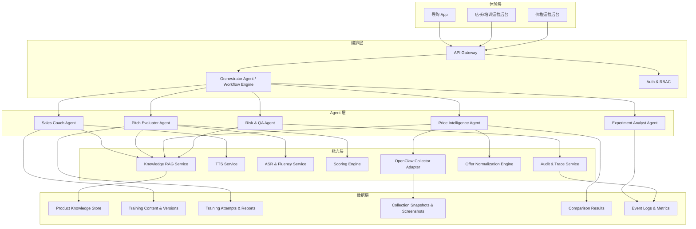
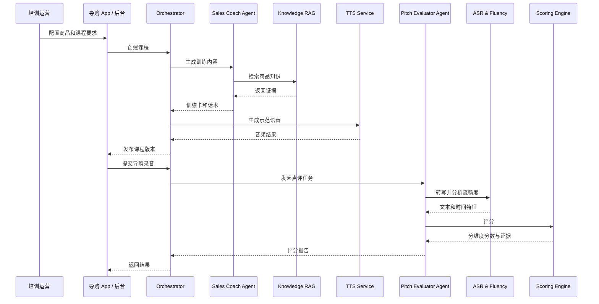
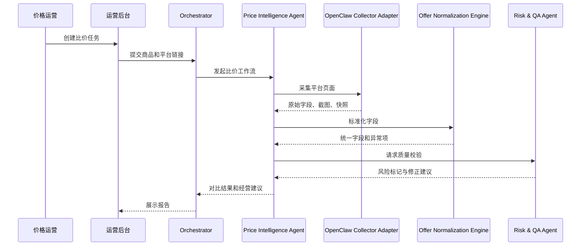

# 一期技术架构：导购培训与跨平台比价

## 1. 设计目标

- 支持一期两个场景快速试点
- Agent 层与能力层解耦，便于后续复用
- 关键结果可追溯、可审计、可人工复核
- 高风险流程支持降级和回退
- 在没有稳定外部接口时，用 OpenClaw 作为浏览器采集适配层

## 2. 非目标

- 不建设通用多租户 AI 平台
- 不做全量实时竞品抓取集群
- 不做视频分析流水线
- 不把 AI 推理结果直接写入绩效或自动定价系统

## 3. 总体架构

## 4. 服务边界

| 服务 | 主要职责 | 输入 | 输出 |
| --- | --- | --- | --- |
| API Gateway | 统一入口、鉴权、限流、请求路由 | HTTP 请求 | 标准响应 |
| Orchestrator / Workflow Engine | 识别任务类型、编排调用链、控制异步流程 | 用户请求、上下文、权限 | 任务计划、执行状态、聚合结果 |
| Knowledge RAG Service | 商品知识检索、证据召回、引用拼装 | 商品 ID、查询意图 | 证据片段、引用元数据 |
| TTS Service | 训练文本转语音 | 文本、音色、语速 | 音频 URL、时长 |
| ASR & Fluency Service | 录音转写、停顿和语速分析 | 音频文件 | 转写文本、时间戳、流畅度特征 |
| Scoring Engine | 按规则和模型输出分维度评分 | 转写文本、标准内容、rubric | 分数、证据、建议 |
| OpenClaw Collector Adapter | 统一调用 OpenClaw 浏览器采集 | 平台任务、页面 URL、字段模板 | 原始字段、快照、截图、错误信息 |
| Offer Normalization Engine | 平台字段标准化、价格和福利口径统一 | 原始字段、平台类型、规则版本 | 标准字段、异常标记 |
| Audit & Trace Service | 记录模型版本、Prompt、知识版本、人工修订 | 调用链事件 | 审计记录、追踪 ID |

## 5. 两条主流程

### 5.1 导购培训流程

### 5.2 跨平台比价流程

## 6. 数据模型建议

### 6.1 导购培训核心实体

| 实体 | 核心字段 |
| --- | --- |
| ProductCourse | course_id, product_id, category_id, objective, required_points, version, status |
| TrainingContent | content_id, course_id, script_text, qa_pairs, evidence_refs, approved_by |
| TrainingAudio | audio_id, content_id, voice, speed, duration_ms, audio_url |
| TrainingAttempt | attempt_id, user_id, course_id, audio_url, submitted_at, status |
| EvaluationReport | report_id, attempt_id, transcript, scores, issues, suggestions, reviewed_by |

### 6.2 比价核心实体

| 实体 | 核心字段 |
| --- | --- |
| ComparisonTask | task_id, source_product_id, operator_id, target_platforms, status |
| CollectionJob | job_id, task_id, platform, url, template_version, collected_at, status |
| RawSnapshot | snapshot_id, job_id, page_text, screenshot_urls, raw_fields |
| NormalizedOffer | offer_id, task_id, platform, normalized_fields, confidence, issue_flags |
| ComparisonReport | report_id, task_id, comparable_type, deltas, recommendations, reviewer_id |

## 7. OpenClaw 集成设计

### 7.1 定位

OpenClaw 作为一期的浏览器采集适配层，负责：

- 打开页面
- 提取页面结构化字段
- 生成页面截图和快照
- 返回采集状态和错误信息

它不负责：

- 价格口径计算
- 同款判断
- 经营建议输出
- 最终业务结论

### 7.2 集成边界

内部适配层只向业务暴露统一接口，例如：

- `collect_competitor_page`
- `get_collection_snapshot`

OpenClaw 的具体 profile、页面动作、字段模板不直接暴露给业务层。

### 7.3 工程策略

- 每个平台独立模板
- 模板带版本号
- 保留原始截图和页面文本
- 采集失败返回明确错误分类
- 对字段缺失和页面变化做监控

### 7.4 风险控制

- 浏览器会话含登录状态时，必须按敏感资源管理
- 对执行页面脚本和远程 CDP 接入做权限隔离
- 采集能力异常时，工作流自动降级为人工复核

根据官方文档，OpenClaw 提供浏览器自动化工具，并支持本地控制、远程节点代理和远程 CDP 模式，这也是把它放在“采集适配层”而不是业务层的主要原因。来源： [Browser (OpenClaw-managed)](https://docs.openclaw.ai/tools/browser) 、[OpenClaw 首页](https://docs.openclaw.ai/index)

## 8. 模型与规则分工

| 能力 | 适合模型 | 适合规则/程序 |
| --- | --- | --- |
| 话术生成 | 是 | 否 |
| 卖点提炼 | 是 | 否 |
| 录音转写总结 | 是 | 否 |
| 流畅度特征提取 | 否 | 是 |
| 评分解释生成 | 是 | 部分 |
| 价格字段标准化 | 部分 | 是 |
| 到手价计算 | 否 | 是 |
| 同款和近似款判断 | 是 | 部分 |
| 风险词和绝对化表述检测 | 部分 | 是 |

原则：

- 确定性口径交给程序
- 表达和解释交给模型
- 高风险结果必须带规则校验

## 9. 失败降级策略

### 9.1 导购培训

- TTS 失败时，保留文本模式
- ASR 失败时，提示重试并保留录音
- 评分失败时，允许店长人工点评补位

### 9.2 跨平台比价

- 页面采集失败时，保留失败码并允许人工补录
- 字段缺失时，报告明确标注“不确定”
- 同款置信度过低时，默认降级为“近似款/不可比”

## 10. 观测与审计

- 全链路 trace_id
- 每次模型调用保留 model_id、prompt_version、knowledge_version
- 每次比价保留 template_version、snapshot_id、review_status
- 每次评分保留 rubric_version、review_status、score_breakdown

## 11. 测试建议

### 11.1 导购培训

- 商品知识召回准确性测试
- TTS 可用性和时长测试
- ASR 转写准确性抽检
- 评分与人工一致性测试

### 11.2 跨平台比价

- 页面采集回归测试
- 字段标准化单元测试
- 同款判断标注集验证
- 对比结果人工复核一致性测试

## 12. 一期建议技术拆分

| 模块 | 负责角色 |
| --- | --- |
| 后台与 API Gateway | 后端 |
| 导购 App 页面与后台页面 | 前端 / 移动端 |
| RAG、Agent、评分链路 | 算法 / 平台 |
| TTS、ASR 集成 | 算法 / 平台 |
| OpenClaw 适配与模板管理 | 后端 / 平台 |
| 指标埋点和报表 | 数据 |
